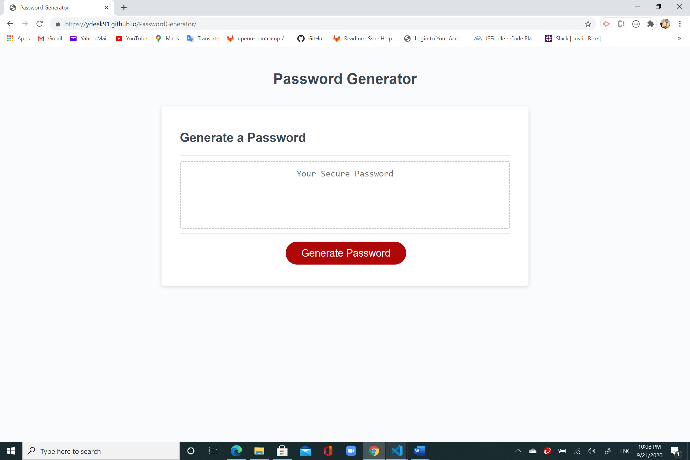
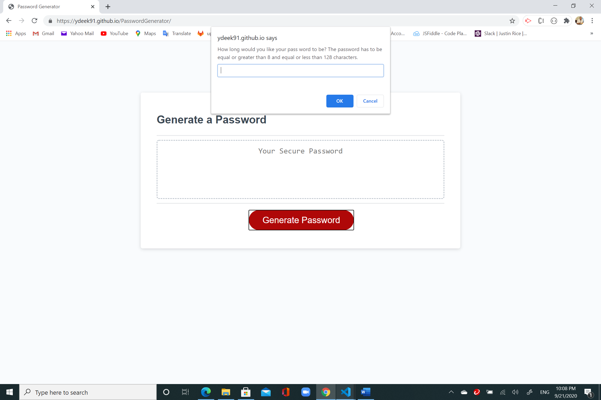
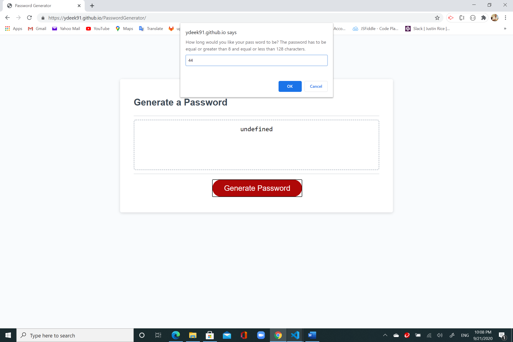
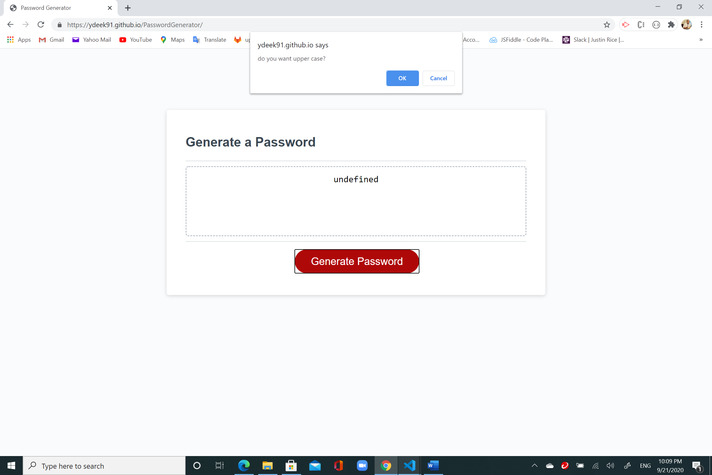

# PasswordGenerator

This project required to generate a random and secured password for users. Javascript was used to generate and users can choose lower case, upper case, numeric, and/or special characters. The required length of the password is between 8 and 128 characters. 

# Link: 

https://ydeek91.github.io/PasswordGenerator/

# Contact Information: 
Email: yazan.deek8@gmail.com
